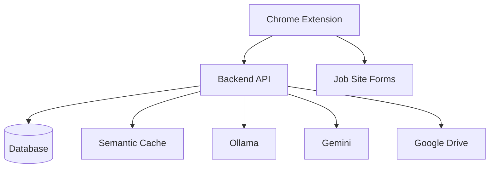
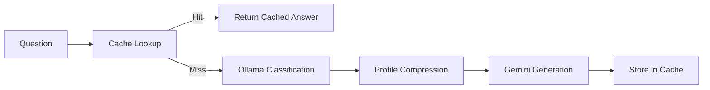
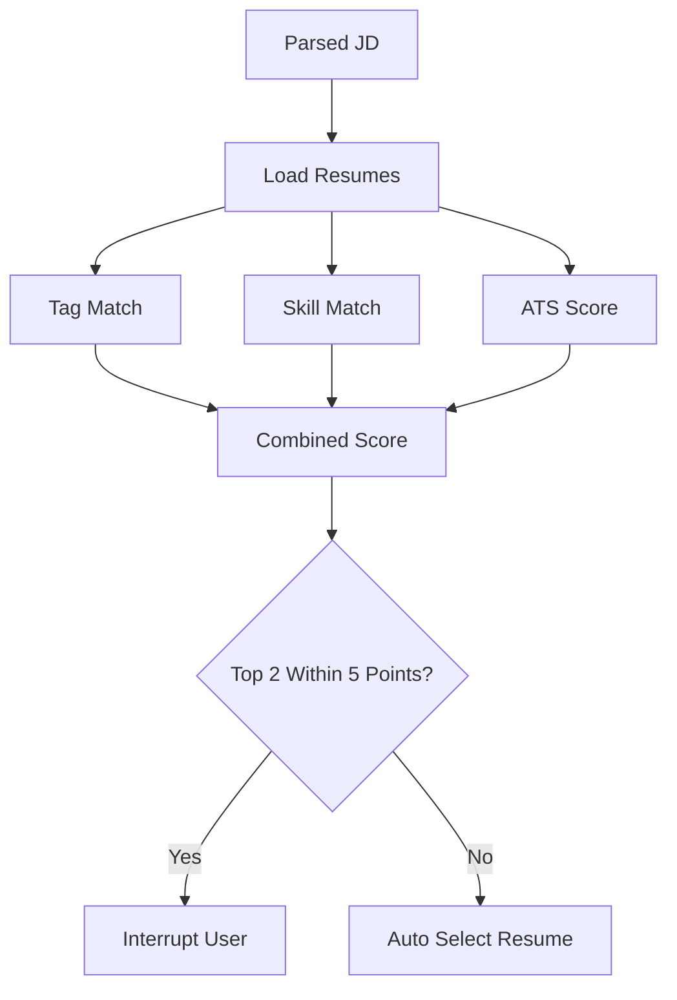
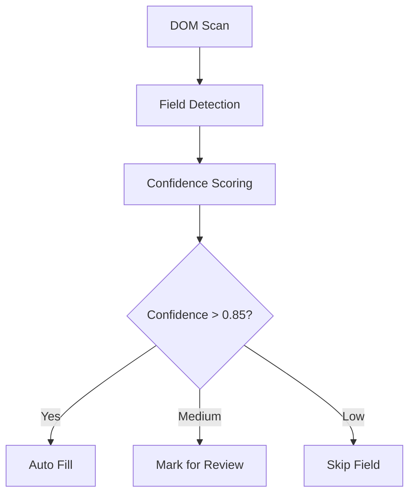

# Lazy Seeker — Architecture Documentation

## Zero-Touch Job Applications

Hybrid AI Layer · Semantic Cache · Local AI Routing · Chrome Extension Autofill

---

# Table of Contents

1. System Overview
2. Core Philosophy
3. High-Level Architecture
4. System Flow
5. Folder Structure
6. Backend Architecture
7. Database Design
8. AI Pipeline
9. Chrome Extension Architecture
10. Resume Selection Logic
11. Interrupt System
12. ATS Scoring
13. API Design
14. Testing Strategy
15. Deployment Flow
16. Mermaid Diagrams
17. Definition of Done

---

# 1. System Overview

Lazy Seeker is a zero-touch AI-assisted job application system.

The user completes onboarding once using structured forms.
After onboarding:

* The extension parses job descriptions.
* Detects and fills forms automatically.
* Selects the best resume.
* Answers application questions.
* Minimizes AI API usage through semantic caching.
* Interrupts the user only when absolutely necessary.

The system is intentionally designed to avoid heavy dependence on cloud LLM calls.
Most operations are deterministic or handled locally.

---

# 2. Core Philosophy

## Onboarding

The user fills structured forms once.

The database becomes the single source of truth.

Resume parsing is NOT trusted as the primary data source.
Resumes are treated only as:

* PDF attachments
* Resume variants
* ATS scoring sources
* Semantic matching sources

## Per Application

The machine performs nearly everything.

Human interruption happens ONLY for:

* Missing salary expectations
* Work authorization ambiguity
* Resume tie decisions
* Captcha walls
* File upload failures

Everything else is automated.

---

# 3. High-Level Architecture

```text
┌────────────────────────────────────────────────────────────┐
│                     CHROME EXTENSION                      │
│                                                            │
│  - Form Detection                                          │
│  - Autofill Engine                                         │
│  - Resume Upload                                           │
│  - Interrupt Panel                                         │
└───────────────────────┬────────────────────────────────────┘
                        │
                        ▼
┌────────────────────────────────────────────────────────────┐
│                         BACKEND                            │
│                                                            │
│  FastAPI + SQLAlchemy + SQLite/Postgres                    │
│                                                            │
│  - Authentication                                          │
│  - Profile APIs                                            │
│  - Resume Library                                          │
│  - Semantic Cache                                          │
│  - ATS Scoring                                             │
│  - Application Tracking                                    │
│  - Interrupt Service                                       │
└───────────────────────┬────────────────────────────────────┘
                        │
          ┌─────────────┴─────────────┐
          ▼                           ▼
┌───────────────────┐      ┌──────────────────────┐
│      OLLAMA       │      │       GEMINI         │
│                   │      │                      │
│ - Classification  │      │ - JD Parsing         │
│ - Compression     │      │ - Answer Generation  │
│ - Routing         │      │                      │
└───────────────────┘      └──────────────────────┘
```

---

# 4. System Flow

## Onboarding Flow

1. Google OAuth
2. Structured forms
3. Education
4. Experience
5. Projects
6. Skills
7. Optional Drive sync
8. Answer seeding
9. Extension activation

## Per Application Flow

1. Job page detected
2. JD parsed using Gemini
3. Resume selected
4. Form fields detected
5. Semantic cache lookup
6. Ollama classification
7. Gemini fallback only on cache miss
8. Interrupt evaluation
9. Autofill + resume upload
10. User submits application
11. Application tracking saved

---

# 5. Folder Structure

```text
lazy-seeker/
├── extension/
│   ├── contents/
│   ├── sidepanel/
│   ├── background/
│   ├── popup/
│   └── adapters/
│
├── backend/
│   ├── app/
│   │   ├── api/
│   │   ├── models/
│   │   ├── services/
│   │   ├── schemas/
│   │   └── core/
│   │
│   ├── tests/
│   └── alembic/
│
├── docs/
├── scripts/
└── .env
```

---

# 6. Backend Architecture

## Stack

* FastAPI
* SQLAlchemy
* Alembic
* SQLite (local)
* PostgreSQL (production)
* Sentence Transformers
* Ollama
* Gemini Flash

## Core Services

| Service              | Purpose                        |
| -------------------- | ------------------------------ |
| cache_service.py     | Semantic answer cache          |
| answer_pipeline.py   | Main AI orchestration          |
| ollama_service.py    | Classification + compression   |
| gemini_service.py    | JD parsing + answer generation |
| ats_scorer.py        | Resume ATS scoring             |
| resume_selector.py   | Resume ranking                 |
| interrupt_service.py | Human interrupt logic          |
| drive_service.py     | Google Drive sync              |

---

# 7. Database Design

## Core Tables

* users
* profiles
* education
* experience
* projects
* skills
* resumes
* answer_cache
* job_descriptions
* applications
* application_answers

## Important Design Decisions

### Structured Forms Over Resume Parsing

Reason:

Resume parsing is inconsistent and lossy.

Structured forms provide:

* Exact schema
* Queryable data
* Reliable automation
* Better semantic retrieval

### Semantic Cache

The answer cache is the most important optimization layer.

Benefits:

* Reduces Gemini usage
* Speeds up applications
* Learns over time
* Improves consistency

---

# 8. AI Pipeline

## Full Answer Pipeline

```text
Question
   │
   ▼
Semantic Cache Lookup
   │
   ├── Cache Hit
   │      └── Return Cached Answer
   │
   └── Cache Miss
           │
           ▼
     Ollama Classification
           │
           ▼
     Profile Compression
           │
           ▼
      Gemini Generation
           │
           ▼
      Store in Cache
```

## Ollama Responsibilities

Ollama NEVER generates final answers.

It only:

* Classifies question type
* Compresses profile context
* Decides personalization necessity

This massively reduces token cost.

## Gemini Responsibilities

Gemini is only used for:

* Job description parsing
* Truly novel question answering

Everything else should hit cache.

---

# 9. Chrome Extension Architecture

## Components

| Component          | Responsibility                 |
| ------------------ | ------------------------------ |
| form-detector.ts   | Detects fields and labels      |
| autofill-engine.ts | Performs fills with DOM events |
| resume-uploader.ts | Uploads PDF resumes            |
| sidepanel          | Review + interrupts            |
| adapters           | Site-specific integrations     |

## Important Technical Detail

React/Vue forms do NOT react to direct `.value=` assignment.

The extension must:

* Use native setters
* Dispatch input events
* Dispatch change events
* Dispatch blur events

Without this, autofill silently fails.

---

# 10. Resume Selection Logic

The system ranks resumes using:

* Domain tag overlap
* Skill overlap
* ATS score
* JD keyword match

## Interrupt Rule

The user is interrupted ONLY when:

* Top two resumes are within 5 points
* Both are above 60

Otherwise selection is silent.

---

# 11. Interrupt System

Interrupts are intentionally minimized.

## Interrupt Conditions

* Salary missing
* Sponsorship missing
* Work authorization missing
* Low confidence required fields
* Resume tie
* Captcha wall

## Non-Interrupt Philosophy

If the machine can reasonably proceed safely:

* It proceeds automatically.
* No user interaction.

---

# 12. ATS Scoring

## ATS Score Breakdown

| Metric               | Weight |
| -------------------- | ------ |
| Sections             | 25     |
| Keyword Match        | 35     |
| Formatting           | 20     |
| Length               | 10     |
| Contact Completeness | 10     |

## Scoring Signals

The scorer checks for:

* Bullet points
* Metrics
* Dates
* Keyword overlap
* Contact fields

Entirely local.
No external API.

---

# 13. API Design

## Authentication

```http
POST /auth/google
POST /auth/login
GET  /auth/me
POST /auth/logout
```

## Onboarding

```http
POST /onboarding/profile
POST /onboarding/education
POST /onboarding/experience
POST /onboarding/projects
POST /onboarding/skills
POST /onboarding/drive-scan
POST /onboarding/complete
```

## Cache

```http
GET    /cache/answers
GET    /cache/answers/match
POST   /cache/answers
PUT    /cache/answers/:id
DELETE /cache/answers/:id
```

---

# 14. Testing Strategy

## Unit Tests

Covers:

* Models
* Services
* Cache similarity
* ATS scoring
* Resume selection
* Interrupt logic
* Form detection

## Integration Tests

Covers:

* Full onboarding
* Full answer pipeline
* Cache reuse
* Resume selection

## End-to-End Tests

Playwright-based browser automation:

* Greenhouse
* Lever
* Resume upload
* Interrupt handling
* Full application flow

---

# 15. Deployment Flow

## Local Development

### Ollama

```bash
ollama serve
```

### Backend

```bash
uvicorn app.main:app --reload --port 8000
```

### Extension

```bash
npm run dev
```

### Tests

```bash
pytest backend/tests/ -v --asyncio-mode=auto
```

---

# 16. Mermaid Diagrams

## Overall System Architecture



## AI Answer Pipeline



## Resume Selection Logic



## Form Autofill Pipeline



---

# 17. Definition of Done

## Onboarding

* Google OAuth working
* Structured forms persisted correctly
* Drive sync operational
* Initial answers seeded

## Per Application

* JD parsed automatically
* Resume selected automatically
* Forms filled correctly
* Semantic cache operational
* Gemini used minimally
* Resume uploaded automatically
* Application tracking saved

## Reliability

* Greenhouse works end-to-end
* Lever works end-to-end
* Cache reuse measurable
* All tests passing

---

# Key Engineering Decisions

## Why SQLite First?

SQLite drastically reduces operational complexity during MVP development.

Advantages:

* Zero infrastructure
* Simple async support
* Easy local debugging
* Fast iteration
* No network latency

Migration to PostgreSQL later is straightforward using SQLAlchemy.

## Why Local Ollama?

Running classification locally avoids wasting Gemini calls.

This architecture dramatically reduces:

* Cost
* Latency
* API dependence

## Why Semantic Cache First?

Most job application questions repeat.

Without cache:

* You repeatedly pay for the same answer.

With cache:

* The system gets cheaper over time.
* Responses become faster.
* Quality becomes more stable.

---

# Future Improvements

## Potential Enhancements

* Adaptive answer tone learning
* Fine-tuned ranking model for resumes
* Multi-language support
* AI-generated resume variants
* Auto follow-up tracking
* Interview preparation assistant
* Recruiter CRM integration
* Email parsing for application status

---

# Final Notes

This system is not just another autofill extension.

The actual differentiation is:

* Structured data architecture
* Semantic memory layer
* Local-first AI routing
* Aggressive reduction of LLM calls
* Deterministic automation pipeline
* Minimal human interruption

The cache layer and structured onboarding are the real moat.

Everything else is implementation.

---

